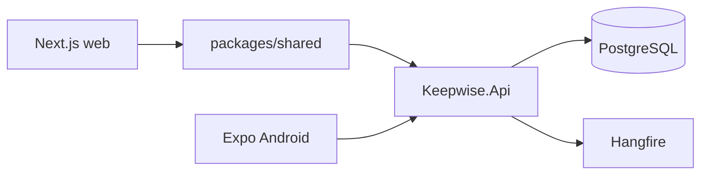

# Architecture

Keepwise is a **modular monolith**. One ASP.NET Core 10 API hosts HTTP + Hangfire workers.

- **Web:** Next.js App Router, Tailwind, local UI primitives (`/dashboard`, `/items`, `/inbox`, `/settings`).
- **Android:** Expo 57. Online-first; currently login + dashboard counts only.
- **Backend modules:** Identity, Catalog, Items (assets), Coverages, Purchases, Ingestion (candidates), Reminders, Notifications, Documents, Dashboard, Privacy.
- **Auth:** Dev JWT locally; Firebase ID tokens when `Auth:FirebaseProjectId` is set and `AllowDevLogin` is false.
- **Jobs:** Recurring — generate reminder occurrences, dispatch due notifications, refresh coverage status. On ingest — Hangfire `IngestionJobs.Process` runs the extraction pipeline (not a recurring job).
- **Files:** `IFileStorage` with local disk in development (GCS later).
- **Notifications:** `INotificationSender` per channel. Email/Push log in dev; SMS/WhatsApp stubs.
- **Extraction:** Heuristic + PDF text first. `IOcrProvider` / `ILlmExtractor` are abstractions; do not add SMS/WhatsApp inbox capture.
