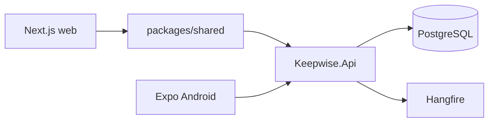

# Architecture

Keepwise is a **modular monolith**. One ASP.NET Core 10 API hosts HTTP + Hangfire workers.

- **Web:** Next.js App Router, Tailwind, local UI primitives.
- **Android:** Expo. Online-first.
- **Backend modules:** Identity, Catalog, Items, Coverages, Reminders, Notifications, Documents, Dashboard.
- **Auth:** Dev JWT locally; Firebase ID tokens when `Auth:FirebaseProjectId` is set and `AllowDevLogin` is false.
- **Jobs:** Generate reminder occurrences, dispatch due notifications, refresh coverage status.
- **Files:** `IFileStorage` with local disk in development (GCS later).
- **Notifications:** `INotificationSender` per channel. Email/Push log in dev; SMS/WhatsApp stubs.
