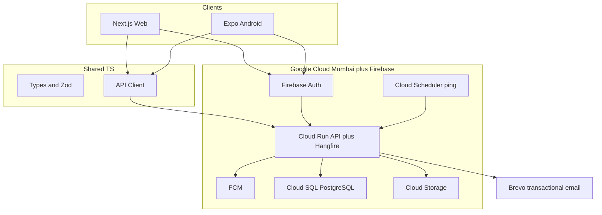
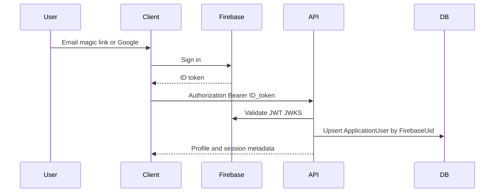
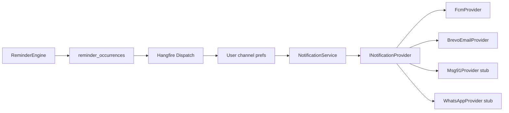

---
todos:
  - id: foundation-docs
    status: completed
    content: 'After approval: Cursor rules, ADRs, context docs, README, gitignore, env examples'
  - id: foundation-backend
    status: completed
    content: 'After approval: ASP.NET Core 10 API skeleton, EF Core, PostgreSQL, Hangfire, Firebase JWT, tests, CI'
  - id: foundation-clients
    status: completed
    content: 'After approval: Next.js web, Expo Android, packages/shared, Turborepo'
  - id: features-later
    status: completed
    content: 'After foundation: implement features one at a time (items → warranties → reminders → notifications)'
name: Keepwise Architecture Plan
overview: 'Plan-only recommendation for Keepwise, a warranty and maintenance reminder app: Expo Android + Next.js web with shared TypeScript packages, ASP.NET Core 10 modular monolith, PostgreSQL, Firebase Auth, Hangfire, and FCM/email notifications—without implementing the app until you approve.'
isProject: false
---
# Keepwise — Architecture and Planning (Step 1)

**Keepwise** is the product name, Git repository name, and app name (web title, Android launcher, Play Store). One word, no hyphen, so it is valid as a GitHub repo slug, C# namespace, npm scope, and Android application id.

- Display name: **Keepwise**
- GitHub repository: `keepwise`
- .NET solution / namespaces: `Keepwise` (`Keepwise.Api`, `Keepwise.Domain`, …)
- npm scope: `@keepwise/shared`, `@keepwise/web`, `@keepwise/mobile`
- Expo `name` / `slug`: Keepwise / `keepwise`
- Android `applicationId`: `app.keepwise`
- Cloud Run service: `keepwise-api`
- Firebase project (when created): `keepwise` (or `keepwise-prod` / `keepwise-dev`)

This phase produces the architecture, stack, and foundation plan only. **No application features and no repository skeleton until you explicitly approve.**

---

## 1. Requirement analysis

**Confirmed (fixed):**
- Passwordless auth only; never store passwords
- ASP.NET Core 10 / .NET 10 / C# REST API
- React ecosystem on web and Android
- Relational DB, reminder engine, multi-channel notifications, private documents
- Tests, Cursor rules, markdown context, Git, CI/CD
- Generic items/categories (not hardcoded appliance lists)
- Users see only their own data
- Timezone-correct reminders

**Confirmed (your choices this session):**
- **Auth:** Firebase Authentication
- **Cloud:** cheapest production-ready, India-first (region when price is close)

**Challenged MVP (important):**
- **SMS and WhatsApp are not MVP.** India DLT, WhatsApp Business approval, and per-message cost will dominate spend and delay launch. MVP channels: **Push (FCM) + Email**. SMS/WhatsApp as Should Have behind the same provider abstraction.
- **Full calendar UI is not MVP.** Dashboard + upcoming-events list delivers the same value. Calendar is Should Have.
- **OCR/AI is Future**, not MVP.
- **Family sharing, iOS, public API, monetization gates** are Future; do not block schema, but keep `UserId` ownership clean.
- **Component-level warranties, km-based vehicle service, product transfer/sale** are Should Have / Future. MVP maintenance is **time-based recurrence only** (optional “odometer at last service” field unused for scheduling).

**Must Have (revised MVP):**
- Firebase passwordless login (email link; Google Sign-In)
- Profile (name, email, mobile optional, country, timezone, language)
- Categories/item types as data
- Items CRUD + archive + search/filter/sort/pagination
- Warranties: duration **or** explicit expiry, extensions, status
- Basic maintenance: one-time + recurring by days/months, complete/skip/reschedule
- Generic **renewals** (insurance/AMC/subscription) as a coverage type—not a separate product
- Reminder rules (defaults 90/30/15/7/1/0 days; custom offsets)
- Reminder engine + Hangfire
- Push + Email, per-channel prefs, idempotent delivery
- Dashboard summary
- Private document upload/download (size/type limits)
- Tests + CI

---

## 2. Assumptions

- Primary market: **India**, English UI, **INR** default; timezone **Asia/Kolkata** default, user-overridable IANA tz.
- Online-first Android (no offline reminder generation).
- Single-tenant-per-user (no household sharing in MVP).
- One production region: **GCP `asia-south1` (Mumbai)** for API, DB, and blobs.
- Firebase Auth identity may be processed **outside India** (legal review; see risks).
- Solo/small-team GitHub flow: `main` + short-lived `feature/*` branches.
- Product remains usable without SMS/WhatsApp.

---

## 3. Open questions (non-blocking)

These do not block foundation work:
- Custom domain (e.g. keepwise.app) when you are ready to buy it
- Play Console developer account (package id is locked as `app.keepwise`)
- Privacy policy / DPDP legal review (required before public launch, not before coding)
- Whether Google Sign-In is day-one or immediately after email-link
- Exact free-tier item limits (monetization later)

---

## 4–5. Recommended architecture and stack

**Style:** Modular monolith (one deployable API + in-process workers). Vertical slices inside modules. Domain logic in testable C# with **no EF types leaking to the API**. **No microservices.**



**Why this cloud (India + cost + Firebase):**
- Firebase Auth and FCM are already on Google; hosting the API on **Cloud Run (`asia-south1`)** avoids a second cloud for identity/push.
- Cloud Run with **min instances = 1** keeps Hangfire alive (reminders cannot depend on scale-to-zero).
- **Cloud SQL PostgreSQL** in Mumbai honors India-first data for app records (items, documents metadata). Cheaper Neon is a documented fallback if you accept non-India DB for early MVP.
- Blobs in **GCS Mumbai** with signed URLs (never public ACLs).
- Web: **Firebase Hosting** (static Next.js export / client-rendered app talking to the API) to avoid a second compute bill.

**Rejected for MVP:** Azure-only stack (weaker fit with Firebase), AWS (no benefit given Firebase), microservices, Hangfire on scale-to-zero Cloud Run, React Native Web as the web app.

---

## 6. Web + Android code-sharing

**Decision: Expo (Android) + Next.js (Web) + `packages/shared` — not React Native Web.**

| Layer | Share? |
| --- | --- |
| Domain types, Zod DTOs, API client, error codes, i18n keys | Yes |
| Warranty/reminder **preview** helpers (optional, fixture-tested) | Yes, thin |
| Date/reminder **source of truth** | **Backend only** |
| Screens, navigation, toasts, file pickers | No |

**Why not RN Web:** Dashboard, tables, filters, and document management need a real web UX. Shared UI would compromise both platforms.

**Monorepo:** `pnpm` + **Turborepo**. Backend is a sibling .NET solution (not forced into Node tooling beyond CI orchestration).

---

## 7. Authentication (Firebase)



- **MVP:** Email magic link + Google Sign-In. **Phone OTP:** Should Have (Firebase Phone; SMS cost/abuse).
- Automatic provisioning: first valid token creates `users` row (`FirebaseUid` unique).
- Sessions: Firebase refresh on clients; API is stateless JWT. Optional `user_devices` table for FCM tokens and logout-all (delete refresh client-side + revoke Firebase refresh tokens where supported).
- Never store passwords. Do not copy Firebase passwords (none exist).
- Rate limit `POST /v1/auth/session` and profile-change endpoints.
- Email/phone changes: Firebase first, then API sync; require re-auth.
- Account deletion: Firebase user delete + anonymize/soft-delete app data + blob delete (DPDP-style erasure; legal review).
- Enumeration protection: generic errors on lookup endpoints; provisioning only via valid Firebase token.

**ASP.NET:** `Microsoft.AspNetCore.Authentication.JwtBearer` with Firebase issuer/audience. Map `user_id` → `ApplicationUser`. Authorization: resource ownership checks on every query (`UserId == current`).

---

## 8. Notification architecture



**Idempotency key (unique constraint):**
`userId + coverageId + reminderRuleId + channel + scheduledDateUtc + occurrenceKind`

Materialize **one row per intended send** before sending. Provider retries update the same row; they never insert a second logical send.

**Reliability:** Hangfire retries with backoff; provider outages → `Failed` + retry until max, then dead-letter. Preference/item/date changes: **cancel pending occurrences** and regenerate. Timezone change: regenerate future occurrences in UTC from local civil dates.

**MVP providers:** FCM (Expo push tokens) + **Brevo** (India-friendly transactional email, cheap). SMS: **MSG91** stub. WhatsApp: **Gupshup or Meta Cloud API** stub.

---

## 9. Database approach

**PostgreSQL 16 + EF Core 10 + Npgsql.** Single `KeepwiseDbContext`. Fluent configurations. **No generic repository layer.** Use `IQueryable` in handlers + explicit transactions for multi-table writes.

**Core model (simplified vs the 20-table proposal):**

- `users`, `user_devices`, `notification_preferences`
- `categories`, `item_types` (seeded, user-extensible later via admin)
- `items` (asset; archive + soft delete)
- `coverages` (discriminator: `Warranty` | `Maintenance` | `Renewal`)
- `warranty_terms` (multiple periods / components as rows; MVP uses one primary term + extensions)
- `maintenance_events` (history: completed/skipped/rescheduled)
- `reminder_rules` (per coverage or user defaults)
- `reminder_occurrences` (scheduled/sent/cancelled; unique idempotency)
- `notification_messages` (provider payload, status, provider message id)
- `attachments` (blob key, hash, content type, size)
- `audit_events` (security-sensitive actions only—not a full CDC log)

**Shared columns:** `Id` UUID, `CreatedAtUtc`, `UpdatedAtUtc`, `RowVersion` (xmin or `xmin` mapped / `uint` xmin), `DeletedAtUtc` where needed.

**Indexes:** `(UserId, DeletedAtUtc)` on items; `(CoverageId, Status, TargetDate)` ; unique occurrence key; `(UserId, ExpiryDate)` for dashboard.

**Concurrency:** `RowVersion` on items/coverages; API returns 409 on conflict.

**Migrations:** EF Core migrations in CI; apply as a Cloud Run Job / release step, never auto-migrate in production on startup.

---

## 10. Background jobs

**Hangfire + PostgreSQL storage, in-process with the API, Cloud Run min=1.**

Plus **Cloud Scheduler** HTTP ping every 5 minutes as a watchdog (enqueue `ProcessDueReminders` if not already running—Hangfire `[DisableConcurrentExecution]`).

Jobs: generate occurrences, dispatch notifications, retry failed, cancel stale, cleanup expired tokens, delete orphaned blobs.

**Why not Quartz:** weaker dashboard/ops for MVP. **Why not Azure Functions:** wrong cloud. **Why not only BackgroundService:** no persistence/retry/history.

---

## 11. Repository structure

```
/
├── .cursor/rules/*.mdc
├── apps/web                 # Next.js + Tailwind + shadcn/ui
├── apps/mobile              # Expo (Android first)
├── packages/shared          # types, zod, api client
├── backend/
│   ├── src/Keepwise.Api
│   ├── src/Keepwise.Domain
│   ├── src/Keepwise.Application
│   ├── src/Keepwise.Infrastructure
│   └── tests/...
├── tests/e2e                # Playwright against web + API
├── docs/                    # context + decisions
├── infrastructure/          # Terraform or Cloud Run YAML later
├── .github/workflows
├── .gitignore
└── README.md
```

Backend modules as folders under Application/Domain (`Identity`, `Items`, `Coverages`, `Reminders`, `Notifications`, `Documents`, `Dashboard`). One API host.

---

## 12–13. Cursor rules and context docs

Create exactly the requested `.cursor/rules/*.mdc` (glob-scoped: `backend.mdc` → `backend/**/*.cs`, `frontend.mdc` → `apps/**/*.{ts,tsx}`, etc.) plus `docs/*.md` and `docs/decisions/ADR-001`…`007`.

Rules encode the 22 Cursor principles, DoD, and “read docs before changing architecture.” No duplicated policy across files—`project.mdc` owns global principles.

---

## 14. Testing strategy

- **Backend unit:** xUnit + FluentAssertions. Domain: warranty expiry, leap years, offsets, occurrence keys, status. **Target ~90% domain coverage.**
- **Application/API integration:** WebApplicationFactory + Testcontainers PostgreSQL. Auth: fake JWT handler in test host (not live Firebase).
- **Frontend:** Vitest + Testing Library for shared package and critical web components. **Detox/Maestro later** for Android; not MVP-blocking.
- **E2E:** Playwright smoke: login (mocked auth), create item, see dashboard.
- CI fails on test failure. Coverage gates on **Domain** project only (e.g. 85%), not 100% solution-wide.

Mandatory cases from the spec (expiry today/tomorrow/yesterday, Feb 29, duration months/years, override, extension, deleted item, disabled channel, duplicate prevention, provider failure/retry, timezone change) live in Domain tests first.

---

## 15. Git / GitHub

- Private GitHub repo named **`keepwise`**; `main` protected; PR + required CI; secret scanning; Dependabot. README title, web `<title>`, Expo app name, and Android label are all **Keepwise**.
- Commits: Conventional Commits (`feat:`, `fix:`, `test:`, `docs:`).
- No GitFlow. No force-push to `main`.
- This environment: commit/push to the **current working branch**; you create the GitHub repo via the Create repo control if it does not exist yet. Foundation work will not claim a remote was created if it was not.

---

## 16. CI/CD

GitHub Actions:
1. Backend: restore, build, `dotnet format`/analyzers, unit + integration tests
2. Web + shared: lint, typecheck, Vitest, production build
3. Mobile: `tsc` + Expo export (EAS build on main/tags, not every PR)
4. gitleaks or `dotnet user-secrets` checks; no secret files
5. Deploy (after MVP): Cloud Run (API) + Firebase Hosting (web) **only on main when checks pass**

Environments: `Development` (Docker Compose: API, Postgres, MailHog, fake FCM), `Test` (CI), `Staging`, `Production` (Mumbai). Staging shares topology with prod at smaller SKUs.

---

## 17. Development roadmap (after approval)

**Phase A — Foundation (first implementation slice):** Cursor rules, docs/ADRs, gitignore, README, .NET 10 API skeleton (health, errors, logging, OpenAPI), EF Core + Postgres, Firebase JWT stub/config, empty Expo + Next.js apps, shared package, CI workflow. **No item/warranty features yet.**

Then feature-by-feature: Identity provisioning → Items → Coverages/Warranties → Maintenance/Renewals → Reminder engine → Notifications → Documents → Dashboard.

Complexity: **large product**; foundation is one vertical slice of tooling, not a demo of all modules.

---

## 18. Complexity

- Domain (dates, reminders, idempotency): high rigor, moderate size
- Cross-platform clients: two UIs + shared client
- Ops (Hangfire + Cloud Run min instances + Firebase): moderate
- SMS/WhatsApp/OCR/iOS: explicitly out of first build

---

## 19. Key risks

- **Firebase + DPDP residency** — identity in Google; legal review before public India launch
- **Hangfire + Cloud Run** — requires min instances ≥ 1 or reminders stall; watchdog via Cloud Scheduler
- **Wrong dates / timezones** — mitigate with UTC storage, IANA tz on user, exhaustive domain tests
- **Duplicate notifications** — unique occurrence keys + transactional outbox-style rows
- **SMS/WhatsApp cost and DLT** — kept out of MVP
- **Auth vendor lock-in** — you accepted Firebase; keep `FirebaseUid` + local `users` so a future issuer could be swapped
- **Notification provider failure** — retries, DLQ, dashboard of failure rate
- **Secret leakage in Git/Cursor** — gitignore, examples only, CI secret scan

---

## 20. Final recommended architecture (one row each)

- **Web:** Next.js (App Router) + TypeScript + Tailwind + shadcn/ui — dashboard-quality web UX
- **Android:** Expo (React Native) + Expo Notifications — Play Store path, FCM
- **Shared frontend:** `packages/shared` types, Zod, API client — not shared screens
- **Monorepo:** pnpm + Turborepo + .NET solution
- **Backend:** ASP.NET Core 10 Web API, modular monolith, vertical slices in modules
- **Architecture:** Modular monolith (not Clean-for-its-own-sake, not microservices)
- **ORM:** EF Core 10 (no extra repositories)
- **Database:** PostgreSQL 16 on Cloud SQL `asia-south1` (Neon optional cost fallback)
- **Authentication:** Firebase Auth (email link + Google); API validates ID tokens
- **Background jobs:** Hangfire (PostgreSQL) in-process; Cloud Scheduler watchdog
- **Push:** FCM via Expo push tokens
- **Email:** Brevo behind `IEmailProvider`
- **SMS:** MSG91 stub (Should Have)
- **WhatsApp:** Gupshup/Meta stub (Should Have)
- **File storage:** GCS signed URLs; 10 MB default; pdf/jpg/png/webp; malware scan later (ClamAV or GCS scanning)
- **Hosting:** Cloud Run (API+worker, Mumbai, min=1) + Firebase Hosting (web) + EAS (Android)
- **CI/CD:** GitHub Actions
- **Monitoring:** Cloud Logging structured JSON + Cloud Monitoring; Hangfire dashboard (secured); Sentry later
- **Unit testing:** xUnit (backend), Vitest (frontend/shared)
- **Integration:** WebApplicationFactory + Testcontainers
- **E2E:** Playwright (web); Android UI tests post-MVP

**Hosting cost sketch (USD/month, order-of-magnitude, India region):**
- **100 users:** ~$25–45 (Cloud Run min 1 + small Cloud SQL + GCS + Brevo free + Firebase free)
- **1,000:** ~$40–80 (same shape, more email)
- **10,000:** ~$120–300 (SQL upsize, extra Cloud Run, email volume)
- **100,000:** ~$800–2,500+ **before SMS/WhatsApp**; those channels become the dominant variable cost

Fixed: Cloud Run min instance, Cloud SQL baseline. Variable: email, SMS, WhatsApp, storage, egress.

---

## UI/UX (MVP screens)

Welcome → Firebase email/Google login → Dashboard → Item list → Add/Edit item (minimal fields + warranty duration or expiry) → Item detail (status, next reminder, documents) → Notification settings → Profile. Calendar, insurance-specific chrome, and OCR are later.

**Design system:** shadcn/ui on web; React Native Paper or native Expo + shared color/type tokens. Accessible, simple, expiry chips (Active / Expiring soon / Expired).

---

## After you approve

Execution order per your rules: repository foundation (rules, docs, skeleton, CI, git) **then** wait or continue into identity—**not** the full reminder platform in one shot.

I will not write application feature code until you approve this plan (and any remaining cloud tweaks). Product/repo/app name is locked as **Keepwise**.
